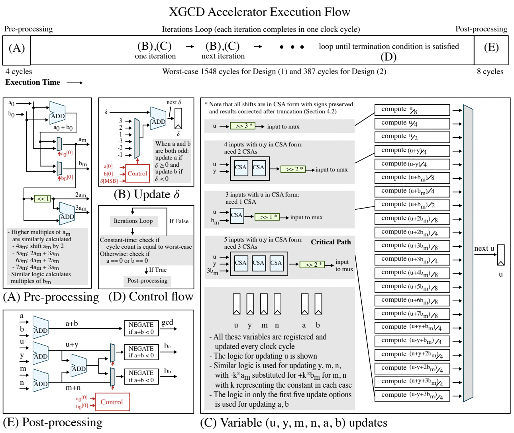

# A Fast Large-Integer Extended GCD Algorithm and Hardware Design for Verifiable Delay Functions and Modular Inversion

[Paper link](https://eprint.iacr.org/2021/1292)

Authors: Kavya Sreedhar, Mark Horowitz, Christopher Torng

Contact: skavya@stanford.edu, ctorng@stanford.edu

<!--  -->
<div align="center">
  
</div>
<p align="left">
  XGCD Execution Flow Diagram – Key components in the execution flow are broken out in detail. (A) Pre-processing step to generate odd inputs to iterations loop; (B) Update for \delta register; (C) Variable updates for a, b, u, y, m, n registers in the iterations loop illustrating the wide parallel datapath with late selects (the logic for unique update types are shown in detail); (D) Control flow state diagram with termination condition; (E) Post-processing step to generate XGCD outputs. Please see the paper link above for more detail.
</p>

## Table of Contents

- [Example Designs](#example-designs)
- [Installation](#installation)
    - [Required System Setup](#required-system-setup)
    - [Repo Setup](#repo-setup)
- [Extended GCD](#extended-gcd)
    - [Directory Structure](#directory-structure)
    - [Functional Model](#functional-model)
    - [Hardware Generator](#hardware-generator)
    - [Tests](#tests)
- [Debugging](#debugging)
- [Physical Design](#physical-design)
    - [SKY 130nm](#sky-130nm)
    - [TSMC 16nm](#tsmc-16nm)
- [Common Issues](#common-issues)
- [Citation](#citation)

## Example Designs

Design | Bitwidth | Constant-time | Technology Node | Area (mm^2) | Clock Frequency (GHz) | Cycles | Execution Time (ns) |
| :---: | :---: | :---: | :---: | :---: | :---: | :---: | :---: |
Design (1) | 1024 | No | TSMC 16nm ASIC | 0.41 | 3.89 | 1143 | 294 |
Design (2) | 255 | Yes | TSMC 16nmn ASIC | 0.059 | 4.55 | 399 | 88 |

Applications:
* Design (1) targets a vdf construction of squaring binary quadratic forms over class groups
* Design (2) targets constant-time modular inversion for Curve25519 (elliptic curve cryptography)

## Installation

### Required System Setup
Note that the code in this repository has been tested on the following platforms:
* MacOS (Big Sur Version 11.4, Catalina 10.15.7)
* Linux (Ubuntu 18.04.6 LTS, CentOS Linux 7 (Core))

System Requirements:
1) DesignWare Library - Datapath and Building Block IP (https://www.synopsys.com/dw/buildingblock.php), specifically DW01_csa (https://www.synopsys.com/dw/ipdir.php?c=DW01_csa) for the DesignWare carry-save adder module and DW_tap (https://www.synopsys.com/dw/ipdir.php?c=DW_tap) for the DesignWare TAP controller (for our JTAG module)
  * We provide a simple handwritten CSA module that can be used instead of the DW01_csa module. Note that the DesignWare CSA module will result in better performance.
  * The DW_tap module is only needed for physical design for JTAG generation. Thus, the extended GCD functional model, hardware generator, and testbench can be run without this file.
2) Python 3.7+ (We have tested these commands with Python 3.7.4 and Python 3.9.4 specifically)
3) Verilator (https://verilator.org/guide/latest/install.html) required for running tests.

For MacOS:
```
brew install verilator
```
4) Genesis r11879 (https://github.com/StanfordVLSI/Genesis2/wiki) required for JTAG in RTL generation for physical design script execution.

### Repo Setup
1) Clone repository:
```
git clone https://github.com/kavyasreedhar/sreedhar-xgcd-hardware-ches2022
cd sreedhar-xgcd-hardware-ches2022
```

2) Create a virtual environment (python3.7+ required)
```
python3.7 -m venv xgcd_env
```

3) Activate virtual environment
```
source xgcd_env/bin/activate
```

4) Install requirements
```
python -m pip install --upgrade pip
pip install -e .
```

The above command installs the below packages.
| Name | Version |
| :---: | :---: |
| kratos | 0.0.38 |
| magma-lang | 2.2.26 |
| fault | 3.1.2 |
| pytest | 7.1.2 |
| mflowgen | 0.4.0 |
| gnureadline | 8.1.2 |

5) Set environment variables:
  * `TOP`: set to the path that should contain this cloned repository, including sreedhar-xgcd-hardware-ches2022
  * `DW_PATH`, set to the file path for DW01_csa.v (the DesignWare carry-save adder module)
```
export TOP=$PWD
# example command, put the file to your DW01_csa.v file here
# skip this step if you are using our simple handwritten CSA module instead of the DesignWare CSA module
export DW_PATH=/path/to/src_ver/DW01_csa.v
```

Notes:
* Steps 1, 2, 4 are one-time installation steps. Steps 3 and 5 must always be run when working with this repository.
* Unless otherwise specified, all commands below should be run from `$TOP`.

## Extended GCD

### Directory Structure
Important files within these directories are explained further in the below sections.
* `$TOP` -- Cloned repository
  * `tests` -- Tests for XGCD hardware generator with functional model
  * `xgcd` -- Project source code
    * `functional_models` -- XGCD functional model in Python
    * `hardware` -- Hardware files, primarily in Kratos (a hardware design language capable of generating SystemVerilog)
      * `extended_gcd` -- Hardware files for XGCD modules
      * `jtag` -- Hardware files for JTAG modules in Genesis
      * `csa.py` -- Hardware files for carry-save adder (CSA) related modules
    * `physical_design` -- Physical design scripts for open-source (SKY130) and commercial (TSMC16) technologies, to the extent possible under TSMC16 NDA
      * `sky130` -- Physical design scripts with mflowgen to run the flow through signoff
      * `tsmc16` -- Physical design scripts with mflowgen to run the flow through synthesis
    * `utils` -- General helper functions
  * `XGCD_debug` -- Directory for logs and waveforms when debugging hardware tests
  * `xgcd_env` -- Virtual environment directory

### Functional Model

Usage:
```
cd $TOP
python xgcd/functional_models/xgcd_model.py -h
```

Arguments:

Name | Type | Description |
| :--- | :---: | :--- |
| bit_length | int | Number of bits for XGCD input data. |
| input_bit_length | int | Number of bits for XGCD datapath (requires input_bit_length >= bit_length). This parameter is only used if diff_bit_lengths is True. |
| diff_bit_lengths | int | If True, read the input_bit_length argument; if False, automatically assign input_bit_length = bit_length. |
| reduction_factor_even | int | Even reduction factor for a, b updates (same factor is used for a and b). Note that the hardware generator allows for different even reduction factors for a, b if desired (using shift_factor_a and shift_factor_b). |
| reduction factor_odd | int | Odd reduction factor for a, b updates. |
| constant_time | bool | If True, evaluate constant-time XGCD. |
| debug | bool | If True, print debugging statements. |
| num_tests | int | Number of XGCD tests to run. |
| random | int | If True, generate random input data; if False, provide inputs to test using test_data in `xgcd_model.py`. |
| use_seed | bool | Seed random inputs (note that this only matters if the random argument is set to True as well) |

Example usage:

For non-constant-time 1024-bit XGCD designs, including Design (1):
* using random inputs, with set seed
```
python xgcd/functional_models/xgcd_model.py  --bit_length 1024 --reduction_factor_even 8 --reduction_factor_odd 4
```
Expected output:
```
Test Stats:
Namespace(bit_length=1024, diff_bit_lengths=False, input_bit_length=1024, debug=False, random=True, use_seed=True, num_tests=1024, constant_time=False, min_pair_bezout=False, reduction_factor_even=8, reduction_factor_odd=4)

Running 1024 tests...
0 / 1024 tests have successfully completed.
100 / 1024 tests have successfully completed.
200 / 1024 tests have successfully completed.
300 / 1024 tests have successfully completed.
400 / 1024 tests have successfully completed.
500 / 1024 tests have successfully completed.
600 / 1024 tests have successfully completed.
700 / 1024 tests have successfully completed.
800 / 1024 tests have successfully completed.
900 / 1024 tests have successfully completed.
1000 / 1024 tests have successfully completed.

All 1024 tests have successfully completed.

Summary stats for our algorithm
-------------------------------
Average number of iterations across the 1024 tests:  1131.140625
Maximum number of iterations across the 1024 tests: 1172
```

For constant-time 255-bit XGCD designs, including Design (2):
* using random inputs, with set seed
```
python xgcd/functional_models/xgcd_model.py  --bit_length 255 --reduction_factor_even 2 --reduction_factor_odd 4 --constant_time
```
Expected output:
```
Test Stats:
Namespace(bit_length=255, diff_bit_lengths=False, input_bit_length=1024, debug=False, random=True, use_seed=True, num_tests=1024, constant_time=True, min_pair_bezout=False, reduction_factor_even=2, reduction_factor_odd=4)

Running 1024 tests...
0 / 1024 tests have successfully completed.
100 / 1024 tests have successfully completed.
200 / 1024 tests have successfully completed.
300 / 1024 tests have successfully completed.
400 / 1024 tests have successfully completed.
500 / 1024 tests have successfully completed.
600 / 1024 tests have successfully completed.
700 / 1024 tests have successfully completed.
800 / 1024 tests have successfully completed.
900 / 1024 tests have successfully completed.
1000 / 1024 tests have successfully completed.

All 1024 tests have successfully completed.

Summary stats for our algorithm
-------------------------------
Average number of iterations across the 1024 tests:  387.0
Maximum number of iterations across the 1024 tests: 387
```

### Hardware Generator
Relevant Files:
* `$TOP/xgcd/hardware/extended_gcd` -- Contains all hardware files required for the extended GCD hardware design
  * `xgcd_top.py` -- Contains top-level wiring for XGCD module
  * `pre_processing.py` -- Executes the pre-processing step in the XGCD algorithm
  * `update_a_b.py` -- Updates a and b every iteration
  * `update_a_b_odd.py` -- Computes updates for a and b when they are both odd
  * `update_bezout.py` -- Updates one Bezout coefficient variable every iteration (four of these modules are required to implement all Bezout coefficient updates)
  * `update_bezout_odd.py` -- Computes updates for one Bezout coefficient variable when a and b are odd
  * `post_processing.py` -- Executes the post-processing step in the XGCD algorithm
  * `half_adder.py` -- Uses a half adder to correct truncated results when shifting in CSA form
  * `xgcd_wrapper.py` -- Top-level wiring for XGCD Unit, JTAG modules, and reset synchronizer
* `$TOP/xgcd/hardware/csa.py` -- Contains CSA-related modules (including logic for shifting in CSA form)
* `$TOP/xgcd/hardware/jtag` -- Contains JTAG modules
* `$TOP/xgcd/hardware/AhaResetSync.py`, `AhaResetSync.v` -- Contains reset synchronizer module

To generate Core XGCD Design with `$TOP/xgcd/hardware/extended_gcd`:

Commonly Used Generator Parameters:

Name | Type | Description |
| :--- | :---: | :--- |
bit_length | int | Number of bits for XGCD inputs. |
reduction_factor_even | int | Even reduction factor for a, b updates (same factor is used for a and b). Note that the hardware generator allows for different even reduction factors for a, b if desired (using shift_factor_a and shift_factor_b). |
reduction factor_odd | int | Odd reduction factor for a, b updates. |
constant_time_support | bool | (default: False) If True, support constant-time evaluation. |
csa_handwritten | bool | (default: False) If True, use our simple handwritten CSA module (instead of the DesignWare module).

```
cd $TOP
python xgcd/hardware/extended_gcd/xgcd_top.py -h
```

* For the full list of generator parameters, please see the XGCDTop module definition in `xgcd_top.py`.
* After executing `xgcd_top.py`, the Verilog output will be at `$TOP/XGCDTop.v`.

Example Usage:

To generate Design (1) Verilog using the DesignWare CSA module:
```
python xgcd/hardware/extended_gcd/xgcd_top.py --bit_length 1024 --reduction_factor_even 8 --reduction_factor_odd 4
```
Expected printout:
```
Verilog Generation Parameter Summary:
Namespace(bit_length=1024, constant_time_support=False, reduction_factor_even=8, reduction_factor_odd=4, csa_handwritten=False, output='XGCDTop.v')

Generating 1024-bit XGCD...
- without constant-time-support
- with DesignWare CSA module

Generated Verilog is at XGCDTop.v
```

To generate Design (1) Verilog with our simple handwritten CSA module:
* Note that this command will take slightly longer than the above command.
```
python xgcd/hardware/extended_gcd/xgcd_top.py --bit_length 1024 --reduction_factor_even 8 --reduction_factor_odd 4 --csa_handwritten
```
Expected printout:
```
Verilog Generation Parameter Summary:
Namespace(bit_length=1024, constant_time_support=False, reduction_factor_even=8, reduction_factor_odd=4, csa_handwritten=True, output='XGCDTop.v')

Generating 1024-bit XGCD...
- without constant-time-support
- with handwritten CSA module (NOT DesignWare CSA module)

Generated Verilog is at XGCDTop.v
```

To generate Design (2) Verilog using the DesignWare CSA module:
```
python xgcd/hardware/extended_gcd/xgcd_top.py --bit_length 255 --reduction_factor_even 2 --reduction_factor_odd 4 --constant_time_support
```
Expected printout:
```
Verilog Generation Parameter Summary:
Namespace(bit_length=255, constant_time_support=True, reduction_factor_even=2, reduction_factor_odd=4, csa_handwritten=False, output='XGCDTop.v')

Generating 255-bit XGCD...
- with constant-time-support
- with DesignWare CSA module

Generated Verilog is at XGCDTop.v
```

To generate Design (2) Verilog with our simple handwritten CSA module:
```
python xgcd/hardware/extended_gcd/xgcd_top.py --bit_length 255 --reduction_factor_even 2 --reduction_factor_odd 4 --constant_time_support --csa_handwritten
```
Expected printout:
```
Verilog Generation Parameter Summary:
Namespace(bit_length=255, constant_time_support=True, reduction_factor_even=2, reduction_factor_odd=4, csa_handwritten=True, output='XGCDTop.v')

Generating 255-bit XGCD...
- with constant-time-support
- with handwritten CSA module (NOT DesignWare CSA module)

Generated Verilog is at XGCDTop.v
```

Here is how to generate the wrapper that instantiates and wires together the XGCDTop, JTAG, and reset synchronizer modules. Note that the first step of the generate RTL step in the Physical Design section below automates this procedure:

* XGCDWrapper generation
    * `python xgcd/hardware/extended_gcd/xgcd_wrapper.py`
    * This script accepts the same arguments as the XGCDTop generation script above (`python xgcd/hardware/extended_gcd/xgcd_top.py`)
    * The generated top-level module XGCDWrapper will instantiate XGCDTop, jtag_wrapper, and AhaResetSync in the output Verilog

For Design (1):
```
python xgcd/hardware/extended_gcd/xgcd_wrapper.py --bit_length 1024 --reduction_factor_even 8 --reduction_factor_odd 4
```
Expected printout:
```
XGCDWrapper Verilog Generation Parameter Summary:
Namespace(bit_length=1024, constant_time_support=False, reduction_factor_even=8, reduction_factor_odd=4, csa_handwritten=False, output='XGCDWrapper.v')

Generating XGCDWrapper at XGCDWrapper.v

Generating 1024-bit XGCD...
- without constant-time-support
- with DesignWare CSA module
```

For Design (2):
```
python xgcd/hardware/extended_gcd/xgcd_wrapper.py --bit_length 255 --reduction_factor_even 2 --reduction_factor_odd 4 --constant_time_support
```
Expected printout:
```
XGCDWrapper Verilog Generation Parameter Summary:
Namespace(bit_length=255, constant_time_support=True, reduction_factor_even=2, reduction_factor_odd=4, csa_handwritten=False, output='XGCDWrapper.v')

Generating XGCDWrapper at XGCDWrapper.v

Generating 255-bit XGCD...
- with constant-time-support
- with DesignWare CSA module
```

The JTAG is generated with the generate RTL step in the Physical Design section (more information below).

### Tests

These tests verify the functionality of the hardware design (`$TOP/xgcd/hardware/xgcd_top.py`) with the functional model (`$TOP/xgcd/functional_models/xgcd_model.py`). The functional model includes assertions that verify the gcd result with Python's math package, as well as the xgcd result using Bezout's Identity.

For each pair of XGCD inputs, our testbench automatically checks functionality for various

* Reduction factor pairs: (2, 4), (4, 4), (8, 4), and (4, 8)
* Levels of constant_time support: no constant-time support, constant_time support with constant_time evaluation configuration set to True, and constant_time support with constant_time evaluation configuration set to False

We split our tests into four categories, which each test inputs with all of the above combinations

* `basic`: Tests small input values on hardware with various input bitwidth support
* `small`: Tests one random input with all of the above combinations, for 12 total tests
* `medium`: Tests 50 random inputs with all of the above combinations, for 600 total tests
* `large`: Tests 100 random inputs with all of the above combinations, for 1200 total tests

First, try our small tests to verify that the repo setup is working. This will run 36 tests (1 random input pair, 12 hardware combinations with reduction factor pair and constant_time support parameters, 3 input bitwidths) and will take about five minutes.

```
cd $TOP
pytest tests/ -k "small" -v
```

The following tests will run:

* `$TOP/tests/test_255_small.py`
* `$TOP/tests/test_512_small.py`
* `$TOP/tests/test_1024_small.py`

Expected output:

* Note that the Python version and directory paths may differ, but all other output should be identical

```
========================================== test session starts ===========================================
platform darwin -- Python 3.9.4, pytest-7.1.2, pluggy-1.0.0 -- /Users/kavya/Desktop/Kavya/xgcd/xgcd_env/bin/python3
cachedir: .pytest_cache
rootdir: /Users/kavya/Desktop/Kavya/xgcd
collected 5616 items / 5580 deselected / 36 selected

tests/test_1024_small.py::test_xgcd[129740214252898973727546781863690236427505086565118448844733374574338935066795444075011107409251780249534288652292843452467431465455814122189084624424706410901040204839071069816085988326202894375752477038977995129925461413982352331306193938911620728120537498098087099200301958466874771000687451301847359266754-49187590039535125951987380134882589439567227195013692231006837852847386192875140839226122174891376217921494817877253369498542074188542392087455774134995355878141646924561048463369962741837813262970855428491139534497215856651744571501108030438689721399347064521728275123901691438822576871224914785078523326200-True-1-2-2-4] PASSED [  2%]
tests/test_1024_small.py::test_xgcd[129740214252898973727546781863690236427505086565118448844733374574338935066795444075011107409251780249534288652292843452467431465455814122189084624424706410901040204839071069816085988326202894375752477038977995129925461413982352331306193938911620728120537498098087099200301958466874771000687451301847359266754-49187590039535125951987380134882589439567227195013692231006837852847386192875140839226122174891376217921494817877253369498542074188542392087455774134995355878141646924561048463369962741837813262970855428491139534497215856651744571501108030438689721399347064521728275123901691438822576871224914785078523326200-True-1-4-4-4] PASSED [  5%]
tests/test_1024_small.py::test_xgcd[129740214252898973727546781863690236427505086565118448844733374574338935066795444075011107409251780249534288652292843452467431465455814122189084624424706410901040204839071069816085988326202894375752477038977995129925461413982352331306193938911620728120537498098087099200301958466874771000687451301847359266754-49187590039535125951987380134882589439567227195013692231006837852847386192875140839226122174891376217921494817877253369498542074188542392087455774134995355878141646924561048463369962741837813262970855428491139534497215856651744571501108030438689721399347064521728275123901691438822576871224914785078523326200-True-1-8-8-4] PASSED [  8%]
tests/test_1024_small.py::test_xgcd[129740214252898973727546781863690236427505086565118448844733374574338935066795444075011107409251780249534288652292843452467431465455814122189084624424706410901040204839071069816085988326202894375752477038977995129925461413982352331306193938911620728120537498098087099200301958466874771000687451301847359266754-49187590039535125951987380134882589439567227195013692231006837852847386192875140839226122174891376217921494817877253369498542074188542392087455774134995355878141646924561048463369962741837813262970855428491139534497215856651744571501108030438689721399347064521728275123901691438822576871224914785078523326200-True-1-4-4-8] PASSED [ 11%]
tests/test_1024_small.py::test_xgcd[129740214252898973727546781863690236427505086565118448844733374574338935066795444075011107409251780249534288652292843452467431465455814122189084624424706410901040204839071069816085988326202894375752477038977995129925461413982352331306193938911620728120537498098087099200301958466874771000687451301847359266754-49187590039535125951987380134882589439567227195013692231006837852847386192875140839226122174891376217921494817877253369498542074188542392087455774134995355878141646924561048463369962741837813262970855428491139534497215856651744571501108030438689721399347064521728275123901691438822576871224914785078523326200-True-0-2-2-4] PASSED [ 13%]
tests/test_1024_small.py::test_xgcd[129740214252898973727546781863690236427505086565118448844733374574338935066795444075011107409251780249534288652292843452467431465455814122189084624424706410901040204839071069816085988326202894375752477038977995129925461413982352331306193938911620728120537498098087099200301958466874771000687451301847359266754-49187590039535125951987380134882589439567227195013692231006837852847386192875140839226122174891376217921494817877253369498542074188542392087455774134995355878141646924561048463369962741837813262970855428491139534497215856651744571501108030438689721399347064521728275123901691438822576871224914785078523326200-True-0-4-4-4] PASSED [ 16%]
tests/test_1024_small.py::test_xgcd[129740214252898973727546781863690236427505086565118448844733374574338935066795444075011107409251780249534288652292843452467431465455814122189084624424706410901040204839071069816085988326202894375752477038977995129925461413982352331306193938911620728120537498098087099200301958466874771000687451301847359266754-49187590039535125951987380134882589439567227195013692231006837852847386192875140839226122174891376217921494817877253369498542074188542392087455774134995355878141646924561048463369962741837813262970855428491139534497215856651744571501108030438689721399347064521728275123901691438822576871224914785078523326200-True-0-8-8-4] PASSED [ 19%]
tests/test_1024_small.py::test_xgcd[129740214252898973727546781863690236427505086565118448844733374574338935066795444075011107409251780249534288652292843452467431465455814122189084624424706410901040204839071069816085988326202894375752477038977995129925461413982352331306193938911620728120537498098087099200301958466874771000687451301847359266754-49187590039535125951987380134882589439567227195013692231006837852847386192875140839226122174891376217921494817877253369498542074188542392087455774134995355878141646924561048463369962741837813262970855428491139534497215856651744571501108030438689721399347064521728275123901691438822576871224914785078523326200-True-0-4-4-8] PASSED [ 22%]
tests/test_1024_small.py::test_xgcd[129740214252898973727546781863690236427505086565118448844733374574338935066795444075011107409251780249534288652292843452467431465455814122189084624424706410901040204839071069816085988326202894375752477038977995129925461413982352331306193938911620728120537498098087099200301958466874771000687451301847359266754-49187590039535125951987380134882589439567227195013692231006837852847386192875140839226122174891376217921494817877253369498542074188542392087455774134995355878141646924561048463369962741837813262970855428491139534497215856651744571501108030438689721399347064521728275123901691438822576871224914785078523326200-False-0-2-2-4] PASSED [ 25%]
tests/test_1024_small.py::test_xgcd[129740214252898973727546781863690236427505086565118448844733374574338935066795444075011107409251780249534288652292843452467431465455814122189084624424706410901040204839071069816085988326202894375752477038977995129925461413982352331306193938911620728120537498098087099200301958466874771000687451301847359266754-49187590039535125951987380134882589439567227195013692231006837852847386192875140839226122174891376217921494817877253369498542074188542392087455774134995355878141646924561048463369962741837813262970855428491139534497215856651744571501108030438689721399347064521728275123901691438822576871224914785078523326200-False-0-4-4-4] PASSED [ 27%]
tests/test_1024_small.py::test_xgcd[129740214252898973727546781863690236427505086565118448844733374574338935066795444075011107409251780249534288652292843452467431465455814122189084624424706410901040204839071069816085988326202894375752477038977995129925461413982352331306193938911620728120537498098087099200301958466874771000687451301847359266754-49187590039535125951987380134882589439567227195013692231006837852847386192875140839226122174891376217921494817877253369498542074188542392087455774134995355878141646924561048463369962741837813262970855428491139534497215856651744571501108030438689721399347064521728275123901691438822576871224914785078523326200-False-0-8-8-4] PASSED [ 30%]
tests/test_1024_small.py::test_xgcd[129740214252898973727546781863690236427505086565118448844733374574338935066795444075011107409251780249534288652292843452467431465455814122189084624424706410901040204839071069816085988326202894375752477038977995129925461413982352331306193938911620728120537498098087099200301958466874771000687451301847359266754-49187590039535125951987380134882589439567227195013692231006837852847386192875140839226122174891376217921494817877253369498542074188542392087455774134995355878141646924561048463369962741837813262970855428491139534497215856651744571501108030438689721399347064521728275123901691438822576871224914785078523326200-False-0-4-4-8] PASSED [ 33%]
tests/test_255_small.py::test_xgcd[37011419202199436911699116621961681821072612210737535774885147375630198915587-28579201187133985494884386205927947524432691876410703363446155211413454751348-True-1-2-2-4] PASSED [ 36%]
tests/test_255_small.py::test_xgcd[37011419202199436911699116621961681821072612210737535774885147375630198915587-28579201187133985494884386205927947524432691876410703363446155211413454751348-True-1-4-4-4] PASSED [ 38%]
tests/test_255_small.py::test_xgcd[37011419202199436911699116621961681821072612210737535774885147375630198915587-28579201187133985494884386205927947524432691876410703363446155211413454751348-True-1-8-8-4] PASSED [ 41%]
tests/test_255_small.py::test_xgcd[37011419202199436911699116621961681821072612210737535774885147375630198915587-28579201187133985494884386205927947524432691876410703363446155211413454751348-True-1-4-4-8] PASSED [ 44%]
tests/test_255_small.py::test_xgcd[37011419202199436911699116621961681821072612210737535774885147375630198915587-28579201187133985494884386205927947524432691876410703363446155211413454751348-True-0-2-2-4] PASSED [ 47%]
tests/test_255_small.py::test_xgcd[37011419202199436911699116621961681821072612210737535774885147375630198915587-28579201187133985494884386205927947524432691876410703363446155211413454751348-True-0-4-4-4] PASSED [ 50%]
tests/test_255_small.py::test_xgcd[37011419202199436911699116621961681821072612210737535774885147375630198915587-28579201187133985494884386205927947524432691876410703363446155211413454751348-True-0-8-8-4] PASSED [ 52%]
tests/test_255_small.py::test_xgcd[37011419202199436911699116621961681821072612210737535774885147375630198915587-28579201187133985494884386205927947524432691876410703363446155211413454751348-True-0-4-4-8] PASSED [ 55%]
tests/test_255_small.py::test_xgcd[37011419202199436911699116621961681821072612210737535774885147375630198915587-28579201187133985494884386205927947524432691876410703363446155211413454751348-False-0-2-2-4] PASSED [ 58%]
tests/test_255_small.py::test_xgcd[37011419202199436911699116621961681821072612210737535774885147375630198915587-28579201187133985494884386205927947524432691876410703363446155211413454751348-False-0-4-4-4] PASSED [ 61%]
tests/test_255_small.py::test_xgcd[37011419202199436911699116621961681821072612210737535774885147375630198915587-28579201187133985494884386205927947524432691876410703363446155211413454751348-False-0-8-8-4] PASSED [ 63%]
tests/test_255_small.py::test_xgcd[37011419202199436911699116621961681821072612210737535774885147375630198915587-28579201187133985494884386205927947524432691876410703363446155211413454751348-False-0-4-4-8] PASSED [ 66%]
tests/test_512_small.py::test_xgcd[11131124899557068741862058561592518079504046495653300707145427789461633036882920487399788808158681316368204285944213603344797542642903805191868520283316585-3495104725420115573371166489124179573918088228342617275036983782911199651299585406475638639213621113074267389327609157584179448626288140116893135735248984-True-1-2-2-4] PASSED [ 69%]
tests/test_512_small.py::test_xgcd[11131124899557068741862058561592518079504046495653300707145427789461633036882920487399788808158681316368204285944213603344797542642903805191868520283316585-3495104725420115573371166489124179573918088228342617275036983782911199651299585406475638639213621113074267389327609157584179448626288140116893135735248984-True-1-4-4-4] PASSED [ 72%]
tests/test_512_small.py::test_xgcd[11131124899557068741862058561592518079504046495653300707145427789461633036882920487399788808158681316368204285944213603344797542642903805191868520283316585-3495104725420115573371166489124179573918088228342617275036983782911199651299585406475638639213621113074267389327609157584179448626288140116893135735248984-True-1-8-8-4] PASSED [ 75%]
tests/test_512_small.py::test_xgcd[11131124899557068741862058561592518079504046495653300707145427789461633036882920487399788808158681316368204285944213603344797542642903805191868520283316585-3495104725420115573371166489124179573918088228342617275036983782911199651299585406475638639213621113074267389327609157584179448626288140116893135735248984-True-1-4-4-8] PASSED [ 77%]
tests/test_512_small.py::test_xgcd[11131124899557068741862058561592518079504046495653300707145427789461633036882920487399788808158681316368204285944213603344797542642903805191868520283316585-3495104725420115573371166489124179573918088228342617275036983782911199651299585406475638639213621113074267389327609157584179448626288140116893135735248984-True-0-2-2-4] PASSED [ 80%]
tests/test_512_small.py::test_xgcd[11131124899557068741862058561592518079504046495653300707145427789461633036882920487399788808158681316368204285944213603344797542642903805191868520283316585-3495104725420115573371166489124179573918088228342617275036983782911199651299585406475638639213621113074267389327609157584179448626288140116893135735248984-True-0-4-4-4] PASSED [ 83%]
tests/test_512_small.py::test_xgcd[11131124899557068741862058561592518079504046495653300707145427789461633036882920487399788808158681316368204285944213603344797542642903805191868520283316585-3495104725420115573371166489124179573918088228342617275036983782911199651299585406475638639213621113074267389327609157584179448626288140116893135735248984-True-0-8-8-4] PASSED [ 86%]
tests/test_512_small.py::test_xgcd[11131124899557068741862058561592518079504046495653300707145427789461633036882920487399788808158681316368204285944213603344797542642903805191868520283316585-3495104725420115573371166489124179573918088228342617275036983782911199651299585406475638639213621113074267389327609157584179448626288140116893135735248984-True-0-4-4-8] PASSED [ 88%]
tests/test_512_small.py::test_xgcd[11131124899557068741862058561592518079504046495653300707145427789461633036882920487399788808158681316368204285944213603344797542642903805191868520283316585-3495104725420115573371166489124179573918088228342617275036983782911199651299585406475638639213621113074267389327609157584179448626288140116893135735248984-False-0-2-2-4] PASSED [ 91%]
tests/test_512_small.py::test_xgcd[11131124899557068741862058561592518079504046495653300707145427789461633036882920487399788808158681316368204285944213603344797542642903805191868520283316585-3495104725420115573371166489124179573918088228342617275036983782911199651299585406475638639213621113074267389327609157584179448626288140116893135735248984-False-0-4-4-4] PASSED [ 94%]
tests/test_512_small.py::test_xgcd[11131124899557068741862058561592518079504046495653300707145427789461633036882920487399788808158681316368204285944213603344797542642903805191868520283316585-3495104725420115573371166489124179573918088228342617275036983782911199651299585406475638639213621113074267389327609157584179448626288140116893135735248984-False-0-8-8-4] PASSED [ 97%]
tests/test_512_small.py::test_xgcd[11131124899557068741862058561592518079504046495653300707145427789461633036882920487399788808158681316368204285944213603344797542642903805191868520283316585-3495104725420115573371166489124179573918088228342617275036983782911199651299585406475638639213621113074267389327609157584179448626288140116893135735248984-False-0-4-4-8] PASSED [100%]

============================ 36 passed, 5580 deselected in 196.20s (0:03:16) =============================
```

These tests can also be run individually.

```
pytest tests/test_255_small.py -v
pytest tests/test_512_small.py -v
pytest tests/test_1024_small.py -v
```

You can also run the basic test, which executes with small input values on the hardware with 255-bit, 512-bit, and 1024-bit input bitwidth support. This test also checks that the order of the two inputs does not affect the final result. In total, it executes 180 tests (5 small input pairs, 12 hardware combinations with reduction factor pair and constant_time support parameters, 3 input bitwidths). This is expected to take longer than the small tests to run.

```
pytest tests/test_basic.py
```

Here is how to execute on more reasonably sized inputs for the hardware datapath bitwidth (e.g., 255-bit inputs on 255-bit hardware datapath and similarly for 512 bits and 1024 bits). This will run 1800 tests (50 random input pairs, 12 hardware combinations with reduction factor pair and constant_time support parameters, 3 input bitwidths).

```
cd $TOP
pytest tests/ -k "medium" -v
```

These tests can also be run individually.

```
pytest tests/test_255_medium.py -v
pytest tests/test_512_medium.py -v
pytest tests/test_1024_medium.py -v
```

Finally, you can also execute a more extensive test suite, again with reasonably sized inputs for the hardware datapath bitwidth (for 255-bit, 512-bit, and 1024-bit hardware datapaths). This will run 3600 tests (100 random input pairs, 12 hardware combinations with reduction factor pair and constant_time support parameters, 3 input bitwidths).

```
cd $TOP
pytest tests/ -k "large" -v
```

These tests can also be run individually.

```
pytest tests/test_255_large.py -v
pytest tests/test_512_large.py -v
pytest tests/test_1024_large.py -v
```

These tests may take a while to run. For example, `tests/test_1024_large.py` runs for 7 hours on our machines.

Test Setup Parameters:

| Name | Type | Default | Description |
| :--- | :---: | :---: | :--- |
| bit_length | int | 1024 | Number of bits for XGCD inputs. |
| use_seed | bool | True | Whether to set random seed to 0. |
| num_inputs | bool | True | Number of input pairs to test reduction factor and constant time support combinations with. |

Commonly Used Testbench Parameters in `$TOP/tests/xgcd_test_core.py` (helper function used in all tests):

Name | Type | Description |
| :--- | :---: | :--- |
A, B | int | XGCD inputs |
shift_factor_a, shift_factor_b | int | Even reduction factor for a, b (note that we enforce both these variables are equal and the same even reduction factor). |
shift_factor_b_odd | int | Odd reduction factor. |
constant_time_support | bool | Whether hardware supports constant_time evaluation. |
constant_time | int (0 or 1) | Constant-time configuration indicating whether constant_time evaluation should be tested (note that constant_time_support must be True if constant_time is 1). |
debug_print | bool | Whether to dump waveforms (vcd) files and print debugging messages. |

## Debugging
To debug a pair of inputs in a test, such as `tests/test_basic.py`:
* Make sure the inputs and hardware parameterization is correctly specified in the test function call at the bottom of the file
* Set `debug_print=True` (as is done in the test function call at the bottom of the file) to dump waveforms and other generated information
* Execute the script, with an example below
```
python tests/test_basic.py
```

Debugging Information:
* We recommend debugging by comparing the waveforms with the functional model output.
* The waveforms will be at `$TOP/XGCD_debug/logs/XGCDTop_W.vcd`. We use gtkwave (http://gtkwave.sourceforge.net/) to view the waveforms.
* The functional model output will be displayed on the terminal that the test command above is run on. Every iteration has an output line such as `a 31 b -2 y 4773 n -24685 u 2241 l -11590 delta 0` that shows the current state of all the variables. This can be compared to the value of these variables every cycle in the waveforms.
* The functional model output also prints other intermediate variables and messages. The level of prints can be controlled by commenting out `print_debug` function calls in `xgcd/functional_models/xgcd_model.py` and `xgcd/functional_models/xgcd_helper.py`
* Our RTL is written in Kratos. The generated Verilog will be at `$TOP/XGCD_debug/XGCDTop_W.v`.

## Physical Design

We use mflowgen (https://github.com/mflowgen/mflowgen, a tool presented at DAC 2022) to assemble our physical design flow. We also draw from mflowgen's common library of reusable scripts to implement much of our flow.

We provide scripts with mflowgen for commercial tools, including Synopsys DC for synthesis and Cadence Innovus 19.10.000 for floorplan, power, place, clock tree synthesis, and route. We use the following tool versions.

| Name | Version | Purpose |
| :--- | :---: | :--- |
| mflowgen | 0.4.0 | Physical design flow organization |
| Synopsys DC | 2019.03 | Synthesis |
| Cadence Innovus | 19.10.000 | Floorplan, power, place, clock tree synthesis, and route |

The information below contains various mflowgen commands. For more information on mflowgen commands and features, please see https://mflowgen.readthedocs.io/en/latest/.

The hardware design parameters can be set in the `parameters` dict in `$TOP/xgcd/physical_design/sky130/design/construct.py` and `$TOP/xgcd/physical_design/tsmc16/design/construct.py` for the physical design flow.

* bit_length
* reduction_factor_even
* reduction_factor_odd
* constant_time support

The following parameters in `construct.py` are REQUIRED. The default values can be used for the first two, but DW_ALL_PATH must be set specifically depending on where your files are.

* design_name -- XGCDWrapper by default
* clock_period -- in nanoseconds
* DW_ALL_PATH -- Path to sim_ver of DW_tap.v, typically in the form of `dw/sim_ver` with the `DW_tap.v` file in `sim_ver`. Do not include the file itself (e.g., `DW_tap.v`) in this parameter.

### SKY 130nm

The SKY130 process node is an open-source hybrid 180nm-130nm technology (https://github.com/google/skywater-pdk). Although our paper focused on TSMC16 results, open-source technologies enable far more accessible replication of results. The SKY130 technology is a real technology that can be fabricated. In this section, we use commercial tools together with this open-source technology.

Here is how to see the steps in the physical design flow with mflowgen:

For Design (1):

```
cd $TOP/xgcd/physical_design/sky130/build
mflowgen run --design ../design/construct_design1.py
make status
```

For Design (2):

```
cd $TOP/xgcd/physical_design/sky130/build
mflowgen run --design ../design/construct_design2.py
make status
```

For any design, with parameters set in `$TOP/xgcd/physical_design/sky130/design/construct.py`:

```
cd $TOP/xgcd/physical_design/sky130/build
mflowgen run --design ../design
make status
```

To generate the RTL (note that "2" corresponds to the number associated with the `rtl` node in `make status` and `make list`:

```
make 2
```

* This step requires Genesis2 r11879 (https://github.com/StanfordVLSI/Genesis2) for JTAG
* This step generates and wires the XGCD hardware, the JTAG modules, and the reset synchornizer. The commands that are run are listed in `$TOP/xgcd/physical_design/sky130/design/rtl/configure.yml`.
* The top level pin names match with the Caravel wrapper provided by Efabless and Google for SKY130 projects.

To run the physical design flow (note that prerequisite steps will be automatically run, and you can simply run the final step):

```
# adk
make 3
# synthesis
make 5
# place
make 9
# clock tree synthesis
make 10
# route
make 12
# signoff
make 14
```

Final GDS location: `$TOP/xgcd/physical_design/sky130/build/15-decapsignoff/design.gds.gz`

### TSMC 16nm

The TSMC16 process node is a 16nm commercial technology. We cannot release PDK files for this technology and PDK-specific scripts since they are under NDA. Thus, we provide our physical design scripts up to the synthesis step. The scripts we provide DO NOT CONTAIN any confidential information.

To see the steps in the physical design flow with mflowgen:

For Design (1):

```
cd $TOP/xgcd/physical_design/tsmc16/build
mflowgen run --design ../design/construct_design1.py
make status
```

For Design (2):

```
cd $TOP/xgcd/physical_design/tsmc16/build
mflowgen run --design ../design/construct_design2.py
make status
```

For any design, with parameters set in `$TOP/xgcd/physical_design/tsmc16/design/construct.py`:

```
cd $TOP/xgcd/physical_design/tsmc16/build
mflowgen run --design ../design
make status
```

To generate the RTL (again, note that "2" corresponds to the number associated with the `rtl` node in `make status` and `make list`:

```
make 2
```

* This step requires Genesis2 r11879 (https://github.com/StanfordVLSI/Genesis2) for JTAG
* This step generates and wires the XGCD hardware, the JTAG modules, and the reset synchornizer. The commands that are run are listed in `$TOP/xgcd/physical_design/tsmc16/design/rtl/configure.yml`.
* The top level pin names match with the Caravel wrapper provided by Efabless and Google for SKY130 projects.

To run synthesis with Synopsys DC (similarly to the RTL step, note that "4" corresponds to the `synopsys-dc-synthesis` node in `make status` and `make list`:

```
make 4
```

## Common Issues

Here are some common errors you may run into when running tests.

Error:
```
        if not follow_symlinks and _islink(src):
            os.symlink(os.readlink(src), dst)
        else:
>           with open(src, 'rb') as fsrc, open(dst, 'wb') as fdst:
E           IsADirectoryError: [Errno 21] Is a directory: '/Users/sreedhar/xgcd'

/usr/local/Cellar/python@3.9/3.9.1_4/Frameworks/Python.framework/Versions/3.9/lib/python3.9/shutil.py:264: IsADirectoryError
```
Solution

* If using the DesignWare CSA module (not our handwritten stub), please make sure that `$DW_PATH` includes `DW01_CSA.v` (it should include the filename `/path/to/src_ver/DW01_csa.v`, instead of only the directory `/path/to/src_ver`.

Error:
```
---------------------------------------------------------- Captured stdout call ----------------------------------------------------------
Generating 1024-bit XGCD with constant-time-support
Using our functional model
Running command: verilator -Wall -Wno-INCABSPATH -Wno-DECLFILENAME -Wno-fatal --cc XGCDTop_1024_W.v --exe XGCDTop_1024_W_driver.cpp --top-module XGCDTop_1024_W
<STDERR>
/bin/sh: verilator: command not found
</STDERR>
```

Solution:

* Install Verilator (see "Required System Setup" section above).

Other notes:
* Unless otherwise specified, all commands should be run from `$TOP`.
* If using our handwritten stub (not the DesignWare CSA module), please make sure that `DW_PATH` is not set (`unset DW_PATH`)

## Citation
```
@article{sreedhar2022fast,
  title={A Fast Large-Integer Extended GCD Algorithm and Hardware Design for Verifiable Delay Functions and Modular Inversion},
  author={Sreedhar, Kavya and Horowitz, Mark and Torng, Christopher},
  journal={IACR Transactions on Cryptographic Hardware and Embedded Systems (TCHES)},
  year={2022}
}
```
